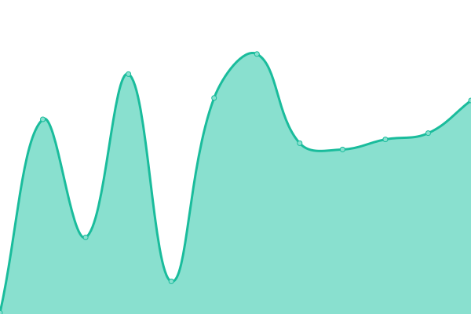

# [📈 Live Status](https://Wiselink.github.io/upptime): <!--live status--> **🟧 Partial outage**

This repository contains the open-source uptime monitor and status page for [Wiselink](https://Wiselink.github.io/upptime), powered by [Upptime](https://github.com/upptime/upptime).

With [Upptime](https://upptime.js.org), you can get your own unlimited and free uptime monitor and status page, powered entirely by a GitHub repository. We use [Issues](https://github.com/Wiselink/upptime/issues) as incident reports, [Actions](https://github.com/Wiselink/upptime/actions) as uptime monitors, and [Pages](https://Wiselink.github.io/upptime) for the status page.

<!--start: status pages-->
<!-- This summary is generated by Upptime (https://github.com/upptime/upptime) -->
<!-- Do not edit this manually, your changes will be overwritten -->
<!-- prettier-ignore -->
| URL | Status | History | Response Time | Uptime |
| --- | ------ | ------- | ------------- | ------ |
|  [FRONT(DEV)](https://dev.wiselink.app) | 🟩 Up | [front-dev.yml](https://github.com/Wiselink/upptime/commits/HEAD/history/front-dev.yml) | 

 293ms
     
 | 

<a href="https://Wiselink.github.io/upptime/history/front-dev">99.38%</a>
    

|  [API Regis - Login(DEV)](https://dev.wiselink.app/api/registration/users/tQvx3WPi4ae5yhA0ZUtqcg6Hzwu1) | 🟩 Up | [api-regis-login-dev.yml](https://github.com/Wiselink/upptime/commits/HEAD/history/api-regis-login-dev.yml) | 

 78ms
     
 | 

<a href="https://Wiselink.github.io/upptime/history/api-regis-login-dev">99.74%</a>
    

|  [API Regis - User Data(DEV)](https://dev.wiselink.app/api/registration/users/tQvx3WPi4ae5yhA0ZUtqcg6Hzwu1/data) | 🟩 Up | [api-regis-user-data-dev.yml](https://github.com/Wiselink/upptime/commits/HEAD/history/api-regis-user-data-dev.yml) | 

 180ms
     
 | 

<a href="https://Wiselink.github.io/upptime/history/api-regis-user-data-dev">99.74%</a>
    

|  [API Regis - Identities(DEV)](https://dev.wiselink.app/api/registration/users/tQvx3WPi4ae5yhA0ZUtqcg6Hzwu1/identities) | 🟩 Up | [api-regis-identities-dev.yml](https://github.com/Wiselink/upptime/commits/HEAD/history/api-regis-identities-dev.yml) | 

 151ms
     
 | 

<a href="https://Wiselink.github.io/upptime/history/api-regis-identities-dev">99.74%</a>
    

|  [API Regis - Search Catgs(DEV)](https://dev.wiselink.app/api/registration/data/search-catg) | 🟩 Up | [api-regis-search-catgs-dev.yml](https://github.com/Wiselink/upptime/commits/HEAD/history/api-regis-search-catgs-dev.yml) | 

 50ms
     
 | 

<a href="https://Wiselink.github.io/upptime/history/api-regis-search-catgs-dev">99.74%</a>
    

|  [API Regis - Get Options(DEV)](https://dev.wiselink.app/api/registration/data/options) | 🟩 Up | [api-regis-get-options-dev.yml](https://github.com/Wiselink/upptime/commits/HEAD/history/api-regis-get-options-dev.yml) | 

 92ms
     
 | 

<a href="https://Wiselink.github.io/upptime/history/api-regis-get-options-dev">99.74%</a>
    

|  [API Regis - Search User by name/lastname(DEV)](https://dev.wiselink.app/api/registration/users/search) | 🟩 Up | [api-regis-search-user-by-name-lastname-dev.yml](https://github.com/Wiselink/upptime/commits/HEAD/history/api-regis-search-user-by-name-lastname-dev.yml) | 

 143ms
     
 | 

<a href="https://Wiselink.github.io/upptime/history/api-regis-search-user-by-name-lastname-dev">99.74%</a>
    

|  [API Comps - Comps - Get Company(DEV)](https://dev.wiselink.app/api/companies-data/companies/a424beb7-cb70-439a-b9e5-1d8520ef8ae4) | 🟩 Up | [api-comps-comps-get-company-dev.yml](https://github.com/Wiselink/upptime/commits/HEAD/history/api-comps-comps-get-company-dev.yml) | 

 126ms
     
 | 

<a href="https://Wiselink.github.io/upptime/history/api-comps-comps-get-company-dev">100.00%</a>
    

|  [API Comps -Comps - Get Comps by owner(DEV)](https://dev.wiselink.app/api/companies-data/companies/owner/tQvx3WPi4ae5yhA0ZUtqcg6Hzwu1) | 🟩 Up | [api-comps-comps-get-comps-by-owner-dev.yml](https://github.com/Wiselink/upptime/commits/HEAD/history/api-comps-comps-get-comps-by-owner-dev.yml) | 

 44ms
     
 | 

<a href="https://Wiselink.github.io/upptime/history/api-comps-comps-get-comps-by-owner-dev">100.00%</a>
    

|  [API Coms - Comps - Get comp identities(DEV)](https://dev.wiselink.app/api/companies-data/companies/owner/tQvx3WPi4ae5yhA0ZUtqcg6Hzwu1/identities) | 🟩 Up | [api-coms-comps-get-comp-identities-dev.yml](https://github.com/Wiselink/upptime/commits/HEAD/history/api-coms-comps-get-comp-identities-dev.yml) | 

 135ms
     
 | 

<a href="https://Wiselink.github.io/upptime/history/api-coms-comps-get-comp-identities-dev">100.00%</a>
    

|  [API Comps - Comps - Get comp status(DEV)](https://dev.wiselink.app/api/companies-data/companies/a424beb7-cb70-439a-b9e5-1d8520ef8ae4/status) | 🟩 Up | [api-comps-comps-get-comp-status-dev.yml](https://github.com/Wiselink/upptime/commits/HEAD/history/api-comps-comps-get-comp-status-dev.yml) | 

 44ms
     
 | 

<a href="https://Wiselink.github.io/upptime/history/api-comps-comps-get-comp-status-dev">100.00%</a>
    

|  [API Comps - Out C - Get Comp(DEV)](https://dev.wiselink.app/api/companies-data/out-companies/a5e613d9-7f27-42a1-8cd2-08507fdbafaf) | 🟥 Down | [api-comps-out-c-get-comp-dev.yml](https://github.com/Wiselink/upptime/commits/HEAD/history/api-comps-out-c-get-comp-dev.yml) | 

 45ms
     
 | 

<a href="https://Wiselink.github.io/upptime/history/api-comps-out-c-get-comp-dev">0.00%</a>
    

|  [API Comps - Out C - Get Comp by owner(DEV)](https://dev.wiselink.app/api/companies-data/out-companies/owner/tQvx3WPi4ae5yhA0ZUtqcg6Hzwu1) | 🟩 Up | [api-comps-out-c-get-comp-by-owner-dev.yml](https://github.com/Wiselink/upptime/commits/HEAD/history/api-comps-out-c-get-comp-by-owner-dev.yml) | 

 44ms
     
 | 

<a href="https://Wiselink.github.io/upptime/history/api-comps-out-c-get-comp-by-owner-dev">100.00%</a>
    

|  [API Comps - Out C - Get Comp Idents(DEV)](https://dev.wiselink.app/api/companies-data/out-companies/owner/tQvx3WPi4ae5yhA0ZUtqcg6Hzwu1/identities) | 🟩 Up | [api-comps-out-c-get-comp-idents-dev.yml](https://github.com/Wiselink/upptime/commits/HEAD/history/api-comps-out-c-get-comp-idents-dev.yml) | 

 44ms
     
 | 

<a href="https://Wiselink.github.io/upptime/history/api-comps-out-c-get-comp-idents-dev">100.00%</a>
    

|  [API Comps - BackOff - Get on hold(DEV)](https://dev.wiselink.app/api/companies-data/back-office/companies?state=on_hold) | 🟩 Up | [api-comps-back-off-get-on-hold-dev.yml](https://github.com/Wiselink/upptime/commits/HEAD/history/api-comps-back-off-get-on-hold-dev.yml) | 

 71ms
     
 | 

<a href="https://Wiselink.github.io/upptime/history/api-comps-back-off-get-on-hold-dev">100.00%</a>
    

|  [API Comps - GrlData - Options(DEV)](https://dev.wiselink.app/api/companies-data/data/options) | 🟩 Up | [api-comps-grl-data-options-dev.yml](https://github.com/Wiselink/upptime/commits/HEAD/history/api-comps-grl-data-options-dev.yml) | 

 84ms
     
 | 

<a href="https://Wiselink.github.io/upptime/history/api-comps-grl-data-options-dev">100.00%</a>
    

|  [API Emps - Get company emps(DEV)](https://dev.wiselink.app/api/employment/employees/company/a424beb7-cb70-439a-b9e5-1d8520ef8ae4) | 🟩 Up | [api-emps-get-company-emps-dev.yml](https://github.com/Wiselink/upptime/commits/HEAD/history/api-emps-get-company-emps-dev.yml) | 

 179ms
     
 | 

<a href="https://Wiselink.github.io/upptime/history/api-emps-get-company-emps-dev">99.74%</a>
    

|  [API Emps - Get Empl user/comp tokens(DEV)](https://dev.wiselink.app/api/employment/employees/user/tQvx3WPi4ae5yhA0ZUtqcg6Hzwu1/company/a424beb7-cb70-439a-b9e5-1d8520ef8ae4) | 🟩 Up | [api-emps-get-empl-user-comp-tokens-dev.yml](https://github.com/Wiselink/upptime/commits/HEAD/history/api-emps-get-empl-user-comp-tokens-dev.yml) | 

 57ms
     
 | 

<a href="https://Wiselink.github.io/upptime/history/api-emps-get-empl-user-comp-tokens-dev">100.00%</a>
    

|  [API Emps - Get Empl user token(DEV)](https://dev.wiselink.app/api/employment/employees/user/tQvx3WPi4ae5yhA0ZUtqcg6Hzwu1) | 🟩 Up | [api-emps-get-empl-user-token-dev.yml](https://github.com/Wiselink/upptime/commits/HEAD/history/api-emps-get-empl-user-token-dev.yml) | 

 123ms
     
 | 

<a href="https://Wiselink.github.io/upptime/history/api-emps-get-empl-user-token-dev">100.00%</a>
    

|  [API Emps - Get Empl job ofers(DEV)](https://dev.wiselink.app/api/employment/employees/user/tQvx3WPi4ae5yhA0ZUtqcg6Hzwu1/offer) | 🟩 Up | [api-emps-get-empl-job-ofers-dev.yml](https://github.com/Wiselink/upptime/commits/HEAD/history/api-emps-get-empl-job-ofers-dev.yml) | 

 46ms
     
 | 

<a href="https://Wiselink.github.io/upptime/history/api-emps-get-empl-job-ofers-dev">100.00%</a>
    

|  [API Emps - Get Empl by token](https://dev.wiselink.app/api/employment/employees/employee/782bb3c5-46bc-4431-ba9a-7d3a23c92d1f/company/a424beb7-cb70-439a-b9e5-1d8520ef8ae4) | 🟩 Up | [api-emps-get-empl-by-token.yml](https://github.com/Wiselink/upptime/commits/HEAD/history/api-emps-get-empl-by-token.yml) | 

 62ms
     
 | 

<a href="https://Wiselink.github.io/upptime/history/api-emps-get-empl-by-token">100.00%</a>
    

|  [API DigCatlg - Get Prod(DEV)](https://dev.wiselink.app/api/digital-catalog/product/product-2ccd5004-c767-4430-9528-c1cc1e11ae51/company/a22f2eb4-fdc8-4416-97dc-4ee2de942e6a) | 🟩 Up | [api-dig-catlg-get-prod-dev.yml](https://github.com/Wiselink/upptime/commits/HEAD/history/api-dig-catlg-get-prod-dev.yml) | 

 60ms
     
 | 

<a href="https://Wiselink.github.io/upptime/history/api-dig-catlg-get-prod-dev">100.00%</a>
    

|  [API DigCatlg - Get Serv(DEV)](https://dev.wiselink.app/api/digital-catalog/service/service-a6b7760b-be84-4e78-92f8-92535b132dd4/company/a424beb7-cb70-439a-b9e5-1d8520ef8ae4) | 🟥 Down | [api-dig-catlg-get-serv-dev.yml](https://github.com/Wiselink/upptime/commits/HEAD/history/api-dig-catlg-get-serv-dev.yml) | 

 45ms
     
 | 

<a href="https://Wiselink.github.io/upptime/history/api-dig-catlg-get-serv-dev">0.00%</a>
    

|  [API DigCatlg - Get Line(DEV)](https://dev.wiselink.app/api/digital-catalog/product-line/line-d71491b6-3b1a-46ba-9486-35432319b504/company/dbc2924a-7600-4113-b39f-8d15b08517a9) | 🟩 Up | [api-dig-catlg-get-line-dev.yml](https://github.com/Wiselink/upptime/commits/HEAD/history/api-dig-catlg-get-line-dev.yml) | 

 45ms
     
 | 

<a href="https://Wiselink.github.io/upptime/history/api-dig-catlg-get-line-dev">100.00%</a>
    

|  [API DigCatlg - Get Line Items(DEV)](https://dev.wiselink.app/api/digital-catalog/product-line/company/dbc2924a-7600-4113-b39f-8d15b08517a9/prod-serv) | 🟩 Up | [api-dig-catlg-get-line-items-dev.yml](https://github.com/Wiselink/upptime/commits/HEAD/history/api-dig-catlg-get-line-items-dev.yml) | 

 45ms
     
 | 

<a href="https://Wiselink.github.io/upptime/history/api-dig-catlg-get-line-items-dev">100.00%</a>
    

|  [API DigCatlg - Get category tree(DEV)](https://gianlucatupapito.xyz/api/digital-catalog/category/) | 🟥 Down | [api-dig-catlg-get-category-tree-dev.yml](https://github.com/Wiselink/upptime/commits/HEAD/history/api-dig-catlg-get-category-tree-dev.yml) | 

 0ms
     
 | 

<a href="https://Wiselink.github.io/upptime/history/api-dig-catlg-get-category-tree-dev">100.00%</a>
    

|  [FRONT(PROD)](https://www.wiselink.app) | 🟩 Up | [front-prod.yml](https://github.com/Wiselink/upptime/commits/HEAD/history/front-prod.yml) | 

 243ms
     
 | 

<a href="https://Wiselink.github.io/upptime/history/front-prod">100.00%</a>
    

|  [API Regis - Login(PROD)](https://www.wiselink.app/api/registration/users/tQvx3WPi4ae5yhA0ZUtqcg6Hzwu1) | 🟩 Up | [api-regis-login-prod.yml](https://github.com/Wiselink/upptime/commits/HEAD/history/api-regis-login-prod.yml) | 

 50ms
     
 | 

<a href="https://Wiselink.github.io/upptime/history/api-regis-login-prod">100.00%</a>
    

|  [API Regis - User Data(PROD)](https://www.wiselink.app/api/registration/users/tQvx3WPi4ae5yhA0ZUtqcg6Hzwu1/data) | 🟩 Up | [api-regis-user-data-prod.yml](https://github.com/Wiselink/upptime/commits/HEAD/history/api-regis-user-data-prod.yml) | 

 172ms
     
 | 

<a href="https://Wiselink.github.io/upptime/history/api-regis-user-data-prod">100.00%</a>
    

|  [API Regis - Identities(PROD)](https://www.wiselink.app/api/registration/users/tQvx3WPi4ae5yhA0ZUtqcg6Hzwu1/identities) | 🟩 Up | [api-regis-identities-prod.yml](https://github.com/Wiselink/upptime/commits/HEAD/history/api-regis-identities-prod.yml) | 

 144ms
     
 | 

<a href="https://Wiselink.github.io/upptime/history/api-regis-identities-prod">100.00%</a>
    

|  [API Regis - Search Catgs(PROD)](https://www.wiselink.app/api/registration/data/search-catg) | 🟩 Up | [api-regis-search-catgs-prod.yml](https://github.com/Wiselink/upptime/commits/HEAD/history/api-regis-search-catgs-prod.yml) | 

 46ms
     
 | 

<a href="https://Wiselink.github.io/upptime/history/api-regis-search-catgs-prod">100.00%</a>
    

|  [API Regis - Get Options(PROD)](https://www.wiselink.app/api/registration/data/options) | 🟩 Up | [api-regis-get-options-prod.yml](https://github.com/Wiselink/upptime/commits/HEAD/history/api-regis-get-options-prod.yml) | 

 95ms
     
 | 

<a href="https://Wiselink.github.io/upptime/history/api-regis-get-options-prod">100.00%</a>
    

|  [API Regis - Search User by name/lastname(PROD)](https://www.wiselink.app/api/registration/users/search) | 🟩 Up | [api-regis-search-user-by-name-lastname-prod.yml](https://github.com/Wiselink/upptime/commits/HEAD/history/api-regis-search-user-by-name-lastname-prod.yml) | 

 167ms
     
 | 

<a href="https://Wiselink.github.io/upptime/history/api-regis-search-user-by-name-lastname-prod">100.00%</a>
    

|  [API Comps - Comps - Get Company(PROD)](https://www.wiselink.app/api/companies-data/companies/a424beb7-cb70-439a-b9e5-1d8520ef8ae4) | 🟩 Up | [api-comps-comps-get-company-prod.yml](https://github.com/Wiselink/upptime/commits/HEAD/history/api-comps-comps-get-company-prod.yml) | 

 116ms
     
 | 

<a href="https://Wiselink.github.io/upptime/history/api-comps-comps-get-company-prod">100.00%</a>
    

|  [API Comps -Comps - Get Comps by owner(PROD)](https://www.wiselink.app/api/companies-data/companies/owner/tQvx3WPi4ae5yhA0ZUtqcg6Hzwu1) | 🟩 Up | [api-comps-comps-get-comps-by-owner-prod.yml](https://github.com/Wiselink/upptime/commits/HEAD/history/api-comps-comps-get-comps-by-owner-prod.yml) | 

 46ms
     
 | 

<a href="https://Wiselink.github.io/upptime/history/api-comps-comps-get-comps-by-owner-prod">100.00%</a>
    

|  [API Coms - Comps - Get comp identities(PROD)](https://www.wiselink.app/api/companies-data/companies/owner/tQvx3WPi4ae5yhA0ZUtqcg6Hzwu1/identities) | 🟩 Up | [api-coms-comps-get-comp-identities-prod.yml](https://github.com/Wiselink/upptime/commits/HEAD/history/api-coms-comps-get-comp-identities-prod.yml) | 

 143ms
     
 | 

<a href="https://Wiselink.github.io/upptime/history/api-coms-comps-get-comp-identities-prod">100.00%</a>
    

|  [API Comps - Comps - Get comp status(PROD)](https://www.wiselink.app/api/companies-data/companies/a424beb7-cb70-439a-b9e5-1d8520ef8ae4/status) | 🟩 Up | [api-comps-comps-get-comp-status-prod.yml](https://github.com/Wiselink/upptime/commits/HEAD/history/api-comps-comps-get-comp-status-prod.yml) | 

 46ms
     
 | 

<a href="https://Wiselink.github.io/upptime/history/api-comps-comps-get-comp-status-prod">100.00%</a>
    

|  [API Comps - Out C - Get Comp(PROD)](https://www.wiselink.app/api/companies-data/out-companies/a5e613d9-7f27-42a1-8cd2-08507fdbafaf) | 🟥 Down | [api-comps-out-c-get-comp-prod.yml](https://github.com/Wiselink/upptime/commits/HEAD/history/api-comps-out-c-get-comp-prod.yml) | 

 48ms
     
 | 

<a href="https://Wiselink.github.io/upptime/history/api-comps-out-c-get-comp-prod">0.00%</a>
    

|  [API Comps - Out C - Get Comp by owner(PROD)](https://www.wiselink.app/api/companies-data/out-companies/owner/tQvx3WPi4ae5yhA0ZUtqcg6Hzwu1) | 🟩 Up | [api-comps-out-c-get-comp-by-owner-prod.yml](https://github.com/Wiselink/upptime/commits/HEAD/history/api-comps-out-c-get-comp-by-owner-prod.yml) | 

 47ms
     
 | 

<a href="https://Wiselink.github.io/upptime/history/api-comps-out-c-get-comp-by-owner-prod">100.00%</a>
    

|  [API Comps - Out C - Get Comp Idents(PROD)](https://www.wiselink.app/api/companies-data/out-companies/owner/tQvx3WPi4ae5yhA0ZUtqcg6Hzwu1/identities) | 🟩 Up | [api-comps-out-c-get-comp-idents-prod.yml](https://github.com/Wiselink/upptime/commits/HEAD/history/api-comps-out-c-get-comp-idents-prod.yml) | 

 48ms
     
 | 

<a href="https://Wiselink.github.io/upptime/history/api-comps-out-c-get-comp-idents-prod">100.00%</a>
    

|  [API Comps - BackOff - Get on hold(PROD)](https://www.wiselink.app/api/companies-data/back-office/companies?state=on_hold) | 🟩 Up | [api-comps-back-off-get-on-hold-prod.yml](https://github.com/Wiselink/upptime/commits/HEAD/history/api-comps-back-off-get-on-hold-prod.yml) | 

 75ms
     
 | 

<a href="https://Wiselink.github.io/upptime/history/api-comps-back-off-get-on-hold-prod">100.00%</a>
    

|  [API Comps - GrlData - Options(PROD)](https://www.wiselink.app/api/companies-data/data/options) | 🟩 Up | [api-comps-grl-data-options-prod.yml](https://github.com/Wiselink/upptime/commits/HEAD/history/api-comps-grl-data-options-prod.yml) | 

 90ms
     
 | 

<a href="https://Wiselink.github.io/upptime/history/api-comps-grl-data-options-prod">100.00%</a>
    

|  [API Emps - Get company emps(PROD)](https://www.wiselink.app/api/employment/employees/company/a424beb7-cb70-439a-b9e5-1d8520ef8ae4) | 🟩 Up | [api-emps-get-company-emps-prod.yml](https://github.com/Wiselink/upptime/commits/HEAD/history/api-emps-get-company-emps-prod.yml) | 

 173ms
     
 | 

<a href="https://Wiselink.github.io/upptime/history/api-emps-get-company-emps-prod">100.00%</a>
    

|  [API Emps - Get Empl user/comp tokens(PROD)](https://www.wiselink.app/api/employment/employees/user/tQvx3WPi4ae5yhA0ZUtqcg6Hzwu1/company/a424beb7-cb70-439a-b9e5-1d8520ef8ae4) | 🟩 Up | [api-emps-get-empl-user-comp-tokens-prod.yml](https://github.com/Wiselink/upptime/commits/HEAD/history/api-emps-get-empl-user-comp-tokens-prod.yml) | 

 61ms
     
 | 

<a href="https://Wiselink.github.io/upptime/history/api-emps-get-empl-user-comp-tokens-prod">100.00%</a>
    

|  [API Emps - Get Empl user token(PROD)](https://www.wiselink.app/api/employment/employees/user/tQvx3WPi4ae5yhA0ZUtqcg6Hzwu1) | 🟩 Up | [api-emps-get-empl-user-token-prod.yml](https://github.com/Wiselink/upptime/commits/HEAD/history/api-emps-get-empl-user-token-prod.yml) | 

 126ms
     
 | 

<a href="https://Wiselink.github.io/upptime/history/api-emps-get-empl-user-token-prod">100.00%</a>
    

|  [API Emps - Get Empl job ofers(PROD)](https://www.wiselink.app/api/employment/employees/user/tQvx3WPi4ae5yhA0ZUtqcg6Hzwu1/offer) | 🟩 Up | [api-emps-get-empl-job-ofers-prod.yml](https://github.com/Wiselink/upptime/commits/HEAD/history/api-emps-get-empl-job-ofers-prod.yml) | 

 47ms
     
 | 

<a href="https://Wiselink.github.io/upptime/history/api-emps-get-empl-job-ofers-prod">100.00%</a>
    

|  [API Emps - Get Empl by token](https://www.wiselink.app/api/employment/employees/employee/782bb3c5-46bc-4431-ba9a-7d3a23c92d1f/company/a424beb7-cb70-439a-b9e5-1d8520ef8ae4) | 🟩 Up | [api-emps-get-empl-by-token.yml](https://github.com/Wiselink/upptime/commits/HEAD/history/api-emps-get-empl-by-token.yml) | 

 62ms
     
 | 

<a href="https://Wiselink.github.io/upptime/history/api-emps-get-empl-by-token">100.00%</a>
    

|  [API DigCatlg - Get Prod(PROD)](https://www.wiselink.app/api/digital-catalog/product/product-2ccd5004-c767-4430-9528-c1cc1e11ae51/company/a22f2eb4-fdc8-4416-97dc-4ee2de942e6a) | 🟩 Up | [api-dig-catlg-get-prod-prod.yml](https://github.com/Wiselink/upptime/commits/HEAD/history/api-dig-catlg-get-prod-prod.yml) | 

 53ms
     
 | 

<a href="https://Wiselink.github.io/upptime/history/api-dig-catlg-get-prod-prod">100.00%</a>
    

|  [API DigCatlg - Get Serv(PROD)](https://www.wiselink.app/api/digital-catalog/service/service-a6b7760b-be84-4e78-92f8-92535b132dd4/company/a424beb7-cb70-439a-b9e5-1d8520ef8ae4) | 🟥 Down | [api-dig-catlg-get-serv-prod.yml](https://github.com/Wiselink/upptime/commits/HEAD/history/api-dig-catlg-get-serv-prod.yml) | 

 46ms
     
 | 

<a href="https://Wiselink.github.io/upptime/history/api-dig-catlg-get-serv-prod">0.00%</a>
    

|  [API DigCatlg - Get Line(PROD)](https://www.wiselink.app/api/digital-catalog/product-line/line-d71491b6-3b1a-46ba-9486-35432319b504/company/dbc2924a-7600-4113-b39f-8d15b08517a9) | 🟩 Up | [api-dig-catlg-get-line-prod.yml](https://github.com/Wiselink/upptime/commits/HEAD/history/api-dig-catlg-get-line-prod.yml) | 

 47ms
     
 | 

<a href="https://Wiselink.github.io/upptime/history/api-dig-catlg-get-line-prod">100.00%</a>
    

|  [API DigCatlg - Get Line Items(PROD)](https://www.wiselink.app/api/digital-catalog/product-line/company/dbc2924a-7600-4113-b39f-8d15b08517a9/prod-serv) | 🟩 Up | [api-dig-catlg-get-line-items-prod.yml](https://github.com/Wiselink/upptime/commits/HEAD/history/api-dig-catlg-get-line-items-prod.yml) | 

 47ms
     
 | 

<a href="https://Wiselink.github.io/upptime/history/api-dig-catlg-get-line-items-prod">100.00%</a>
    

|  [API DigCatlg - Get category tree(PROD)](https://wiselink.app/api/digital-catalog/category/) | 🟩 Up | [api-dig-catlg-get-category-tree-prod.yml](https://github.com/Wiselink/upptime/commits/HEAD/history/api-dig-catlg-get-category-tree-prod.yml) | 

 447ms
     
 | 

<a href="https://Wiselink.github.io/upptime/history/api-dig-catlg-get-category-tree-prod">100.00%</a>
    

<!--end: status pages-->

[**Visit our status website →**](https://Wiselink.github.io/upptime)

## 📄 License

- Powered by: [Upptime](https://github.com/upptime/upptime)
- Code: [MIT](./LICENSE) © [Wiselink](https://Wiselink.github.io/upptime)
- Data in the `./history` directory: [Open Database License](https://opendatacommons.org/licenses/odbl/1-0/)
