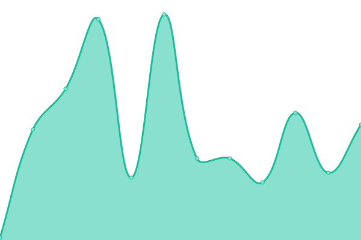

# [📈 Live Status](https://Wiselink.github.io/upptime): <!--live status--> **🟧 Partial outage**

This repository contains the open-source uptime monitor and status page for [Wiselink](https://Wiselink.github.io/upptime), powered by [Upptime](https://github.com/upptime/upptime).

With [Upptime](https://upptime.js.org), you can get your own unlimited and free uptime monitor and status page, powered entirely by a GitHub repository. We use [Issues](https://github.com/Wiselink/upptime/issues) as incident reports, [Actions](https://github.com/Wiselink/upptime/actions) as uptime monitors, and [Pages](https://Wiselink.github.io/upptime) for the status page.

<!--start: status pages-->
<!-- This summary is generated by Upptime (https://github.com/upptime/upptime) -->
<!-- Do not edit this manually, your changes will be overwritten -->
<!-- prettier-ignore -->
| URL | Status | History | Response Time | Uptime |
| --- | ------ | ------- | ------------- | ------ |
|  [FRONT(DEV)](https://www.gianlucatupapito.xyz) | 🟥 Down | [front-dev.yml](https://github.com/Wiselink/upptime/commits/HEAD/history/front-dev.yml) | 

 262ms
     
 | 

<a href="https://Wiselink.github.io/upptime/history/front-dev">99.73%</a>
    

|  [API Regis - Login(DEV)](https://www.gianlucatupapito.xyz/api/registration/users/tQvx3WPi4ae5yhA0ZUtqcg6Hzwu1) | 🟩 Up | [api-regis-login-dev.yml](https://github.com/Wiselink/upptime/commits/HEAD/history/api-regis-login-dev.yml) | 

 61ms
     
 | 

<a href="https://Wiselink.github.io/upptime/history/api-regis-login-dev">100.00%</a>
    

|  [API Regis - User Data(DEV)](https://www.gianlucatupapito.xyz/api/registration/users/tQvx3WPi4ae5yhA0ZUtqcg6Hzwu1/data) | 🟥 Down | [api-regis-user-data-dev.yml](https://github.com/Wiselink/upptime/commits/HEAD/history/api-regis-user-data-dev.yml) | 

 145ms
     
 | 

<a href="https://Wiselink.github.io/upptime/history/api-regis-user-data-dev">62.08%</a>
    

|  [API Regis - Identities(DEV)](https://www.gianlucatupapito.xyz/api/registration/users/tQvx3WPi4ae5yhA0ZUtqcg6Hzwu1/identities) | 🟥 Down | [api-regis-identities-dev.yml](https://github.com/Wiselink/upptime/commits/HEAD/history/api-regis-identities-dev.yml) | 

 104ms
     
 | 

<a href="https://Wiselink.github.io/upptime/history/api-regis-identities-dev">62.04%</a>
    

|  [API Regis - Search Catgs(DEV)](https://www.gianlucatupapito.xyz/api/registration/data/search-catg) | 🟩 Up | [api-regis-search-catgs-dev.yml](https://github.com/Wiselink/upptime/commits/HEAD/history/api-regis-search-catgs-dev.yml) | 

 87ms
     
 | 

<a href="https://Wiselink.github.io/upptime/history/api-regis-search-catgs-dev">99.95%</a>
    

|  [API Regis - Get Options(DEV)](https://www.gianlucatupapito.xyz/api/registration/data/options) | 🟩 Up | [api-regis-get-options-dev.yml](https://github.com/Wiselink/upptime/commits/HEAD/history/api-regis-get-options-dev.yml) | 

 94ms
     
 | 

<a href="https://Wiselink.github.io/upptime/history/api-regis-get-options-dev">99.95%</a>
    

|  [API Regis - Search User by name/lastname(DEV)](https://www.gianlucatupapito.xyz/api/registration/users/search) | 🟩 Up | [api-regis-search-user-by-name-lastname-dev.yml](https://github.com/Wiselink/upptime/commits/HEAD/history/api-regis-search-user-by-name-lastname-dev.yml) | 

 63ms
     
 | 

<a href="https://Wiselink.github.io/upptime/history/api-regis-search-user-by-name-lastname-dev">99.95%</a>
    

|  [API Comps - Comps - Get Company(DEV)](https://www.gianlucatupapito.xyz/api/companies-data/companies/a424beb7-cb70-439a-b9e5-1d8520ef8ae4) | 🟥 Down | [api-comps-comps-get-company-dev.yml](https://github.com/Wiselink/upptime/commits/HEAD/history/api-comps-comps-get-company-dev.yml) | 

 62ms
     
 | 

<a href="https://Wiselink.github.io/upptime/history/api-comps-comps-get-company-dev">61.90%</a>
    

|  [API Comps -Comps - Get Comps by owner(DEV)](https://www.gianlucatupapito.xyz/api/companies-data/companies/owner/tQvx3WPi4ae5yhA0ZUtqcg6Hzwu1) | 🟥 Down | [api-comps-comps-get-comps-by-owner-dev.yml](https://github.com/Wiselink/upptime/commits/HEAD/history/api-comps-comps-get-comps-by-owner-dev.yml) | 

 875ms
     
 | 

<a href="https://Wiselink.github.io/upptime/history/api-comps-comps-get-comps-by-owner-dev">62.67%</a>
    

|  [API Coms - Comps - Get comp identities(DEV)](https://www.gianlucatupapito.xyz/api/companies-data/companies/owner/tQvx3WPi4ae5yhA0ZUtqcg6Hzwu1/identities) | 🟥 Down | [api-coms-comps-get-comp-identities-dev.yml](https://github.com/Wiselink/upptime/commits/HEAD/history/api-coms-comps-get-comp-identities-dev.yml) | 

 148ms
     
 | 

<a href="https://Wiselink.github.io/upptime/history/api-coms-comps-get-comp-identities-dev">62.26%</a>
    

|  [API Comps - Comps - Get comp status(DEV)](https://www.gianlucatupapito.xyz/api/companies-data/companies/a424beb7-cb70-439a-b9e5-1d8520ef8ae4/status) | 🟥 Down | [api-comps-comps-get-comp-status-dev.yml](https://github.com/Wiselink/upptime/commits/HEAD/history/api-comps-comps-get-comp-status-dev.yml) | 

 46ms
     
 | 

<a href="https://Wiselink.github.io/upptime/history/api-comps-comps-get-comp-status-dev">42.67%</a>
    

|  [API Comps - Out C - Get Comp(DEV)](https://www.gianlucatupapito.xyz/api/companies-data/out-companies/a5e613d9-7f27-42a1-8cd2-08507fdbafaf) | 🟥 Down | [api-comps-out-c-get-comp-dev.yml](https://github.com/Wiselink/upptime/commits/HEAD/history/api-comps-out-c-get-comp-dev.yml) | 

 52ms
     
 | 

<a href="https://Wiselink.github.io/upptime/history/api-comps-out-c-get-comp-dev">42.16%</a>
    

|  [API Comps - Out C - Get Comp by owner(DEV)](https://www.gianlucatupapito.xyz/api/companies-data/out-companies/owner/tQvx3WPi4ae5yhA0ZUtqcg6Hzwu1) | 🟥 Down | [api-comps-out-c-get-comp-by-owner-dev.yml](https://github.com/Wiselink/upptime/commits/HEAD/history/api-comps-out-c-get-comp-by-owner-dev.yml) | 

 50ms
     
 | 

<a href="https://Wiselink.github.io/upptime/history/api-comps-out-c-get-comp-by-owner-dev">62.27%</a>
    

|  [API Comps - Out C - Get Comp Idents(DEV)](https://www.gianlucatupapito.xyz/api/companies-data/out-companies/owner/tQvx3WPi4ae5yhA0ZUtqcg6Hzwu1/identities) | 🟥 Down | [api-comps-out-c-get-comp-idents-dev.yml](https://github.com/Wiselink/upptime/commits/HEAD/history/api-comps-out-c-get-comp-idents-dev.yml) | 

 49ms
     
 | 

<a href="https://Wiselink.github.io/upptime/history/api-comps-out-c-get-comp-idents-dev">61.79%</a>
    

|  [API Comps - BackOff - Get on hold(DEV)](https://www.gianlucatupapito.xyz/api/companies-data/back-office/companies?state=on_hold) | 🟥 Down | [api-comps-back-off-get-on-hold-dev.yml](https://github.com/Wiselink/upptime/commits/HEAD/history/api-comps-back-off-get-on-hold-dev.yml) | 

 57ms
     
 | 

<a href="https://Wiselink.github.io/upptime/history/api-comps-back-off-get-on-hold-dev">61.85%</a>
    

|  [API Comps - GrlData - Options(DEV)](https://www.gianlucatupapito.xyz/api/companies-data/data/options) | 🟥 Down | [api-comps-grl-data-options-dev.yml](https://github.com/Wiselink/upptime/commits/HEAD/history/api-comps-grl-data-options-dev.yml) | 

 80ms
     
 | 

<a href="https://Wiselink.github.io/upptime/history/api-comps-grl-data-options-dev">62.05%</a>
    

|  [API Emps - Get company emps(DEV)](https://www.gianlucatupapito.xyz/api/employment/employees/company/a424beb7-cb70-439a-b9e5-1d8520ef8ae4) | 🟥 Down | [api-emps-get-company-emps-dev.yml](https://github.com/Wiselink/upptime/commits/HEAD/history/api-emps-get-company-emps-dev.yml) | 

 88ms
     
 | 

<a href="https://Wiselink.github.io/upptime/history/api-emps-get-company-emps-dev">99.82%</a>
    

|  [API Emps - Get Empl user/comp tokens(DEV)](https://www.gianlucatupapito.xyz/api/employment/employees/user/tQvx3WPi4ae5yhA0ZUtqcg6Hzwu1/company/a424beb7-cb70-439a-b9e5-1d8520ef8ae4) | 🟥 Down | [api-emps-get-empl-user-comp-tokens-dev.yml](https://github.com/Wiselink/upptime/commits/HEAD/history/api-emps-get-empl-user-comp-tokens-dev.yml) | 

 54ms
     
 | 

<a href="https://Wiselink.github.io/upptime/history/api-emps-get-empl-user-comp-tokens-dev">42.47%</a>
    

|  [API Emps - Get Empl user token(DEV)](https://www.gianlucatupapito.xyz/api/employment/employees/user/tQvx3WPi4ae5yhA0ZUtqcg6Hzwu1) | 🟥 Down | [api-emps-get-empl-user-token-dev.yml](https://github.com/Wiselink/upptime/commits/HEAD/history/api-emps-get-empl-user-token-dev.yml) | 

 66ms
     
 | 

<a href="https://Wiselink.github.io/upptime/history/api-emps-get-empl-user-token-dev">99.53%</a>
    

|  [API Emps - Get Empl job ofers(DEV)](https://www.gianlucatupapito.xyz/api/employment/employees/user/tQvx3WPi4ae5yhA0ZUtqcg6Hzwu1/offer) | 🟥 Down | [api-emps-get-empl-job-ofers-dev.yml](https://github.com/Wiselink/upptime/commits/HEAD/history/api-emps-get-empl-job-ofers-dev.yml) | 

 49ms
     
 | 

<a href="https://Wiselink.github.io/upptime/history/api-emps-get-empl-job-ofers-dev">99.80%</a>
    

|  [API Emps - Get Empl by token](https://www.gianlucatupapito.xyz/api/employment/employees/employee/782bb3c5-46bc-4431-ba9a-7d3a23c92d1f/company/a424beb7-cb70-439a-b9e5-1d8520ef8ae4) | 🟥 Down | [api-emps-get-empl-by-token.yml](https://github.com/Wiselink/upptime/commits/HEAD/history/api-emps-get-empl-by-token.yml) | 

 53ms
     
 | 

<a href="https://Wiselink.github.io/upptime/history/api-emps-get-empl-by-token">0.68%</a>
    

|  [API DigCatlg - Get Prod(DEV)](https://www.gianlucatupapito.xyz/api/digital-catalog/product/product-2ccd5004-c767-4430-9528-c1cc1e11ae51/company/a22f2eb4-fdc8-4416-97dc-4ee2de942e6a) | 🟥 Down | [api-dig-catlg-get-prod-dev.yml](https://github.com/Wiselink/upptime/commits/HEAD/history/api-dig-catlg-get-prod-dev.yml) | 

 59ms
     
 | 

<a href="https://Wiselink.github.io/upptime/history/api-dig-catlg-get-prod-dev">99.80%</a>
    

|  [API DigCatlg - Get Serv(DEV)](https://www.gianlucatupapito.xyz/api/digital-catalog/service/service-49fc3560-ff3d-49e6-a455-71fcc673f137/company/dbc2924a-7600-4113-b39f-8d15b08517a9) | 🟥 Down | [api-dig-catlg-get-serv-dev.yml](https://github.com/Wiselink/upptime/commits/HEAD/history/api-dig-catlg-get-serv-dev.yml) | 

 49ms
     
 | 

<a href="https://Wiselink.github.io/upptime/history/api-dig-catlg-get-serv-dev">41.88%</a>
    

|  [API DigCatlg - Get Line(DEV)](https://www.gianlucatupapito.xyz/api/digital-catalog/product-line/line-d71491b6-3b1a-46ba-9486-35432319b504/company/dbc2924a-7600-4113-b39f-8d15b08517a9) | 🟥 Down | [api-dig-catlg-get-line-dev.yml](https://github.com/Wiselink/upptime/commits/HEAD/history/api-dig-catlg-get-line-dev.yml) | 

 58ms
     
 | 

<a href="https://Wiselink.github.io/upptime/history/api-dig-catlg-get-line-dev">99.80%</a>
    

|  [API DigCatlg - Get Line Items(DEV)](https://www.gianlucatupapito.xyz/api/digital-catalog/product-line/company/dbc2924a-7600-4113-b39f-8d15b08517a9/prod-serv) | 🟥 Down | [api-dig-catlg-get-line-items-dev.yml](https://github.com/Wiselink/upptime/commits/HEAD/history/api-dig-catlg-get-line-items-dev.yml) | 

 60ms
     
 | 

<a href="https://Wiselink.github.io/upptime/history/api-dig-catlg-get-line-items-dev">99.59%</a>
    

|  [API DigCatlg - Get category tree](https://gianlucatupapito.xyz/api/digital-catalog/category/) | 🟥 Down | [api-dig-catlg-get-category-tree.yml](https://github.com/Wiselink/upptime/commits/HEAD/history/api-dig-catlg-get-category-tree.yml) | 

 457ms
     
 | 

<a href="https://Wiselink.github.io/upptime/history/api-dig-catlg-get-category-tree">99.80%</a>
    

<!--end: status pages-->

[**Visit our status website →**](https://Wiselink.github.io/upptime)

## 📄 License

- Powered by: [Upptime](https://github.com/upptime/upptime)
- Code: [MIT](./LICENSE) © [Wiselink](https://Wiselink.github.io/upptime)
- Data in the `./history` directory: [Open Database License](https://opendatacommons.org/licenses/odbl/1-0/)
