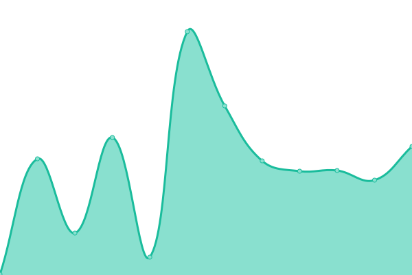

# [📈 Live Status](https://Wiselink.github.io/upptime): <!--live status--> **🟩 All systems operational**

This repository contains the open-source uptime monitor and status page for [Wiselink](https://Wiselink.github.io/upptime), powered by [Upptime](https://github.com/upptime/upptime).

With [Upptime](https://upptime.js.org), you can get your own unlimited and free uptime monitor and status page, powered entirely by a GitHub repository. We use [Issues](https://github.com/Wiselink/upptime/issues) as incident reports, [Actions](https://github.com/Wiselink/upptime/actions) as uptime monitors, and [Pages](https://Wiselink.github.io/upptime) for the status page.

<!--start: status pages-->
<!-- This summary is generated by Upptime (https://github.com/upptime/upptime) -->
<!-- Do not edit this manually, your changes will be overwritten -->
<!-- prettier-ignore -->
| URL | Status | History | Response Time | Uptime |
| --- | ------ | ------- | ------------- | ------ |
|  [API Regis | Login(DEV)](https://www.gianlucatupapito.xyz/api/registration/users/ZeLytRmZ78RSgwXCEsktT1Zg63k1) | 🟩 Up | [api-regis-login-dev.yml](https://github.com/Wiselink/upptime/commits/HEAD/history/api-regis-login-dev.yml) | 

 175ms
     
 | 

<a href="https://Wiselink.github.io/upptime/history/api-regis-login-dev">100.00%</a>
    

|  [API Regis | User Data(DEV)](https://www.gianlucatupapito.xyz/api/registration/users/ZeLytRmZ78RSgwXCEsktT1Zg63k1/data) | 🟩 Up | [api-regis-user-data-dev.yml](https://github.com/Wiselink/upptime/commits/HEAD/history/api-regis-user-data-dev.yml) | 

 109ms
     
 | 

<a href="https://Wiselink.github.io/upptime/history/api-regis-user-data-dev">100.00%</a>
    

|  [API Regis | Identities(DEV)](https://www.gianlucatupapito.xyz/api/registration/users/ZeLytRmZ78RSgwXCEsktT1Zg63k1/identities) | 🟩 Up | [api-regis-identities-dev.yml](https://github.com/Wiselink/upptime/commits/HEAD/history/api-regis-identities-dev.yml) | 

 84ms
     
 | 

<a href="https://Wiselink.github.io/upptime/history/api-regis-identities-dev">100.00%</a>
    

|  [API Regis | Search Catgs(DEV)](https://www.gianlucatupapito.xyz/api/registration/data/search-catg) | 🟩 Up | [api-regis-search-catgs-dev.yml](https://github.com/Wiselink/upptime/commits/HEAD/history/api-regis-search-catgs-dev.yml) | 

 39ms
     
 | 

<a href="https://Wiselink.github.io/upptime/history/api-regis-search-catgs-dev">100.00%</a>
    

|  [API Regis | Get Options(DEV)](https://www.gianlucatupapito.xyz/api/registration/data/options) | 🟩 Up | [api-regis-get-options-dev.yml](https://github.com/Wiselink/upptime/commits/HEAD/history/api-regis-get-options-dev.yml) | 

 79ms
     
 | 

<a href="https://Wiselink.github.io/upptime/history/api-regis-get-options-dev">100.00%</a>
    

|  [API Regis | Search User by name/lastname(DEV)](https://www.gianlucatupapito.xyz/api/registration/users/search) | 🟩 Up | [api-regis-search-user-by-name-lastname-dev.yml](https://github.com/Wiselink/upptime/commits/HEAD/history/api-regis-search-user-by-name-lastname-dev.yml) | 

 48ms
     
 | 

<a href="https://Wiselink.github.io/upptime/history/api-regis-search-user-by-name-lastname-dev">100.00%</a>
    

<!--end: status pages-->

[**Visit our status website →**](https://Wiselink.github.io/upptime)

## 📄 License

- Powered by: [Upptime](https://github.com/upptime/upptime)
- Code: [MIT](./LICENSE) © [Wiselink](https://Wiselink.github.io/upptime)
- Data in the `./history` directory: [Open Database License](https://opendatacommons.org/licenses/odbl/1-0/)
